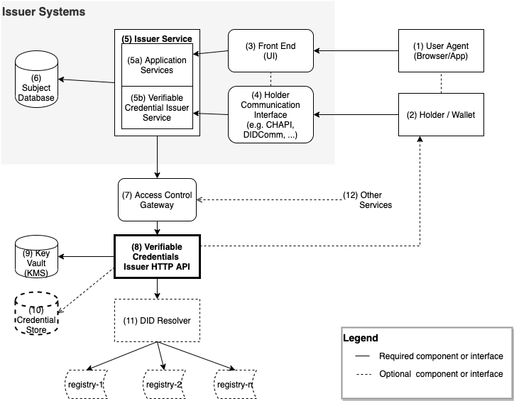

#  Verifiable Credential Issuer HTTP API Architecture Model
This document describes the architecture model and context for the Verifiable
Credential Issuer HTTP API.

## Overview
The Verifiable Credential Issuer HTTP API is designed to be a consistent API for
Issuer Services to call in order to generate Verifiable Credentials. This API is
intended for Issuer Services who are able to manage and secure external
connections to Holders. This API encapsulates and abstracts the Verifiable
Credential data model, format, and proof methods from Issuer Services. This API
also abstracts any underlying DID methods, resolver capabilities, and
cryptographic algorithms from the Issuer Services.

## Objectives
The following capture the objectives of this API.
1. Provide an open and consistent HTTP based API for Issuer Services to leverage
when generating Verifiable Credentials.
1. Abstract the underlying data model, formats and proof mechanisms from the
Issuer Services.
1. Abstract the underlying DID methods and cryptographic algorithms from the
Issuer Services as required.
1. Rely on 'upstream' Issuer Services to manage connections with external
entities (like Holder software).

These objectives allow for Issuer Services to modify their underlying Verifiable
Credential, supported DID methods, and cryptographic suites software with
minimal impact to their application services, business logic and user experience.  

## Component Overview
The following diagram is a high level, generic overview of the intended
architecture context for this API.

## Limitations and Considerations
I'm sure its fine.
